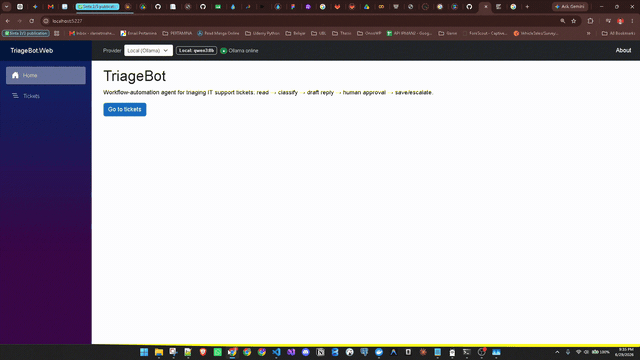
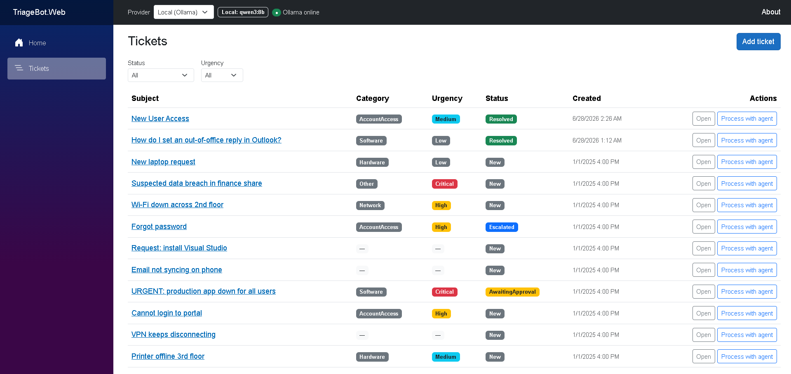
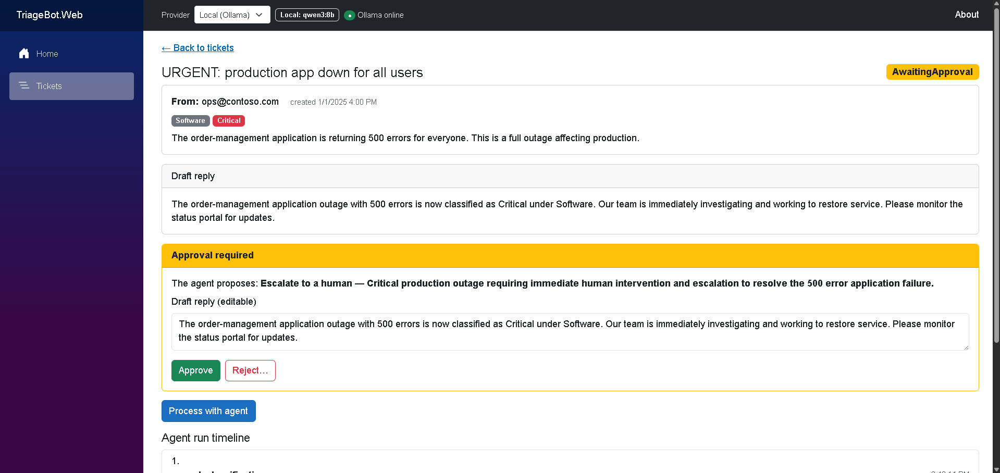
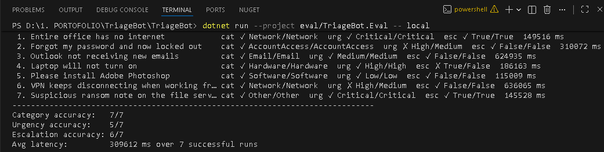

# TriageBot


**An AI agent that triages IT support tickets — read, classify, draft a reply, and resolve or escalate, with a human approving every final action.**

TriageBot is a production-minded .NET 10 sample that shows how to build a *real* LLM **agent** (not a chatbot): it reasons over a ticket, calls tools to mutate state, records every step for audit, and pauses for human approval before doing anything irreversible. It runs against a **local model (Ollama)** or a **cloud model (Gemini)**, switchable at runtime.

> ⚠️ This is a portfolio MVP built to demonstrate engineering judgement around agents, tool calling, and human-in-the-loop design — not a finished product. See [Limitations](#limitations).



> 🎥 A higher-quality MP4 of the same walkthrough is at [`docs/demo.mp4`](docs/demo.mp4).

---

## What this project demonstrates

A compact but honest showcase of the skills behind shipping an AI feature, not just calling an API:

- 🧠 **Agent design** — tool calling, a bounded reasoning loop, and knowing *when an agent is (and isn't) the right tool*.
- 🙋 **Human-in-the-loop** — a custom approval gate so the model proposes but a person decides every irreversible action.
- 🔀 **Provider abstraction** — one codebase, two LLMs (local Ollama / cloud Gemini), switchable at runtime via keyed DI.
- 🏛️ **Clean Architecture** — dependencies point inward; the domain knows nothing about EF Core or any LLM.
- 🛡️ **Production-mindedness** — retries, graceful failure, input validation, RFC 7807 errors, structured logging.
- 📊 **Evaluation** — a harness that measures classification and escalation accuracy, because "it's AI" is not a test strategy.

## Problem statement

IT helpdesks drown in repetitive, loosely-structured tickets: password lockouts, VPN drops, "install this app", the occasional genuine outage. Most need the same first steps — read the message, work out *what* it is and *how urgent* it is, write a sensible first reply, then either close it or route it to the right people.

Doing that by hand is slow and inconsistent, and the input is natural language, so rigid rules miss the nuance. An LLM is good at exactly this part (reading intent, drafting a reply), but you can't let a model silently resolve or escalate tickets on its own. TriageBot automates the judgement-heavy first pass **and keeps a human in control of the consequential actions.**

## Features

- **Agentic triage pipeline** — classify → draft reply → resolve/escalate, driven by the model through tool calls.
- **Human-in-the-loop approval** — the agent only *proposes* a final action (resolve or escalate); it is queued and executed only after a human approves. The reviewer can edit the draft reply before approving, or reject (with a reason), in which case nothing is executed.
- **Runtime provider switching** — toggle between a local Ollama model and Google Gemini from the header; the choice is per session.
- **Full audit trail** — every run is an `AgentRun` with one `AgentStep` per tool call (arguments, result, timestamp), surfaced as a timeline in the UI.
- **Resilience** — transient provider failures are retried; an unreachable model fails the run cleanly (recorded, ticket not stranded) instead of crashing.
- **Blazor Server UI** — dashboard with filters, ticket detail with the run timeline and approval card.
- **Small eval harness** — measure classification and escalation accuracy against a labelled dataset, per provider.

## Architecture

Clean Architecture across four projects:

| Project                    | Responsibility                                                            |
| -------------------------- | ------------------------------------------------------------------------- |
| `TriageBot.Web`            | ASP.NET Core + Blazor Server: UI, API endpoints, composition root.        |
| `TriageBot.Core`           | Domain models, enums, tool & service abstractions (no external deps).     |
| `TriageBot.Infrastructure` | EF Core, the LLM agent, tools, and provider wiring behind Core interfaces. |
| `TriageBot.Tests`          | xUnit unit tests for tools and services.                                  |

### The layers (dependencies point inward)

```
   ┌────────────────────────────────────────────────────────────────────────┐
   │  TriageBot.Web  ·  Presentation                                         │
   │  Blazor Server UI · API endpoints · composition root (DI wiring)        │
   └─────────────────────────┬───────────────────────────┬──────────────────┘
                             │ depends on                │ registers (DI)
                             ▼                            ▼
   ┌──────────────────────────────────┐   ┌──────────────────────────────────┐
   │  TriageBot.Core  ·  Domain       │   │  TriageBot.Infrastructure        │
   │  entities · enums · interfaces   │◀──│  EF Core · Agent · Tools · LLM   │
   │  (ITicketTriageService, …)       │   │  concrete impls of Core's        │
   │  NO external dependencies        │   │  interfaces                      │
   └──────────────────────────────────┘   └──────────────────────────────────┘
              ▲
              └── Core depends on nothing outward; Web and Infrastructure both
                  depend on Core. Swap the DB or the LLM without touching the domain.
```

Why it matters: the domain (`Core`) defines *contracts* and knows nothing about EF Core, Ollama, or Gemini. Infrastructure implements those contracts; the Web host wires them together. That inversion is what lets the same agent logic run against two different LLM providers, and makes the tools and services unit-testable in isolation.

### Agent flow

```
                ┌─────────────────────────── AgentRun (audited) ───────────────────────────┐
                │                                                                           │
  Ticket  ──▶  read  ──▶  record_classification  ──▶  draft_reply  ──▶  propose final action
                │            (category, urgency)        (reply text)        │           │
                │                                                           ▼           ▼
                │                                              save_ticket_result   escalate_to_human
                │                                                           │           │
                └───────────────────────────────────────────────────────  ▼ ─────────  ▼
                                                              ⏸  PAUSE — ticket = AwaitingApproval
                                                                           │
                                                  Human reviews ───────────┤
                                                                           │
                                          Approve (optionally edit draft)  │  Reject (with reason)
                                                                           ▼
                                            execute proposed action          nothing executed
                                            → Resolved / Escalated           → Rejected
```

**Tools the agent can call** (each call is persisted as an `AgentStep`):

| Tool                  | Effect                                                                   |
| --------------------- | ------------------------------------------------------------------------ |
| `record_classification` | Sets the ticket's category and urgency (runs immediately).             |
| `draft_reply`           | Saves a proposed reply to the requester (runs immediately).            |
| `save_ticket_result`    | **Proposes** finalizing the ticket (e.g. Resolved) — queued for approval. |
| `escalate_to_human`     | **Proposes** escalating to a person — queued for approval.             |

The two final actions are *proposals*: calling one stores the pending action on the run, moves the ticket to `AwaitingApproval`, and stops the agent. A separate, deterministic approval step executes (or cancels) it — no second LLM round-trip decides the outcome.

### When is an agent the right choice?

Reaching for an "AI agent" is often overkill. It's worth being honest about when a plain function or `switch` beats an agent:

- **A deterministic rule is enough** when inputs are structured and the mapping is fixed (HTTP 500 → page on-call; form field == "billing" → billing queue). Don't pay for an LLM to do an `if`.
- **A single LLM call** (no tools, no loop) is enough when you just need one classification or one piece of generated text and your code decides what to do with it.
- **An agent earns its place** when the *control flow itself* depends on the model's reading of unstructured input, and the work is a multi-step sequence of actions whose shape varies per case.

TriageBot is the third case, and deliberately so: the ticket is free-form natural language; the category, urgency, the content of the reply, *and* the decision to resolve vs. escalate all depend on understanding it; and the steps chain (you draft a reply differently once you know it's a critical outage). That non-deterministic, NLP-driven branching across multiple tool calls is what an agent is for. **At the same time**, the one place where determinism matters — actually changing the ticket's state — is taken *out* of the model's hands and gated behind human approval. That split (model for judgement, code + human for consequences) is the point of the design.

## Key code

Three snippets that capture the design (trimmed for readability — see the source for the full versions).

**1. Human-in-the-loop — the "final" tools *propose*, they don't act.** The agent can only call `Request…` variants, which persist the intended action and pause the ticket instead of executing it:

```csharp
// TicketTools.cs
[Description("Propose finalizing the ticket ... This does NOT take effect immediately: " +
             "it is queued for human approval. After calling this, stop and wait.")]
public Task<ToolResult> RequestSaveTicketResultAsync(Guid ticketId, TicketStatus status, ...)
    => QueueForApprovalAsync(ticketId, SaveTicketResultTool, new { status }, ct);

private async Task<ToolResult> QueueForApprovalAsync(Guid ticketId, string toolName, object args, ...)
{
    var run = await _db.AgentRuns.FindAsync([_agentRunId], ct);
    run.PendingToolName      = toolName;                             // what the agent wants to do
    run.PendingArgumentsJson = JsonSerializer.Serialize(args, JsonOptions);
    ticket.Status            = TicketStatus.AwaitingApproval;        // ...but a human decides
    // ...append an AgentStep, save, and tell the model to stop and wait.
}
```

**2. Runtime provider switching via keyed DI.** Two `IChatClient`s under stable keys; the resolver picks one per session — and the tool-calling loop is bounded:

```csharp
// AiServiceCollectionExtensions.cs
services.AddKeyedChatClient("local", sp => BuildOpenAiCompatibleClient(/* Ollama  */))
    .UseFunctionInvocation(configure: f => f.MaximumIterationsPerRequest = 10) // bound the loop
    .UseLogging();
services.AddKeyedChatClient("gemini", sp => BuildOpenAiCompatibleClient(/* Gemini */))
    .UseFunctionInvocation()
    .UseLogging();

// AiClientResolver.cs — resolve the client for the session's active provider at runtime.
public IChatClient GetChatClient(AiProvider provider)
    => _serviceProvider.GetRequiredKeyedService<IChatClient>(KeyFor(provider));
```

**3. Deterministic approval — no second LLM round-trip decides the outcome.** On approve, code executes the *exact* action the agent proposed:

```csharp
// TicketApprovalService.cs
switch (run.PendingToolName)
{
    case TicketTools.SaveTicketResultTool:
        var status = ParseEnumArg(run.PendingArgumentsJson, "status", TicketStatus.Resolved);
        await tools.SaveTicketResultAsync(ticketId, status, ct);
        break;
    case TicketTools.EscalateToHumanTool:
        var reason = ParseStringArg(run.PendingArgumentsJson, "reason") ?? "Escalation approved.";
        await tools.EscalateToHumanAsync(ticketId, reason, ct);
        break;
}
```

## Tech stack

| Area            | Choice                                                                 |
| --------------- | ---------------------------------------------------------------------- |
| Runtime         | .NET 10                                                                |
| UI              | Blazor Server (Interactive Server components, Bootstrap)               |
| Agent framework | Microsoft Agent Framework (`Microsoft.Agents.AI`)                      |
| LLM abstraction | `Microsoft.Extensions.AI` (+ `Microsoft.Extensions.AI.OpenAI`)         |
| Local LLM       | Ollama, default model `qwen3:8b` (OpenAI-compatible endpoint)          |
| Cloud LLM       | Google Gemini (`gemini-2.5-flash`, OpenAI-compatible endpoint)         |
| Resilience      | `Microsoft.Extensions.Http.Resilience` (Polly)                         |
| Persistence     | PostgreSQL + EF Core 10 (Npgsql)                                       |
| Tests / eval    | xUnit; a standalone eval console                                       |

## Getting started

### Prerequisites

- [.NET 10 SDK](https://dotnet.microsoft.com/download)
- [Docker](https://www.docker.com/) (for PostgreSQL)
- [Ollama](https://ollama.com/) for the local model, with a tool-capable model pulled:
  ```bash
  ollama pull qwen3:8b
  ```
- *(Optional)* a Google Gemini API key if you want to use the cloud provider.

### 1. Start the database

```bash
docker compose up -d        # PostgreSQL on localhost:5433
docker compose ps           # wait for "healthy"
```

> Host port **5433** is used to avoid clashing with a native PostgreSQL install on 5432. Change the
> published port in `docker-compose.yml` and the `TriageBotDb` connection string together if needed.

### 2. Apply migrations (creates the schema + seeds sample tickets)

```bash
dotnet ef database update --project src/TriageBot.Infrastructure --startup-project src/TriageBot.Web
```

### 3. (Optional) configure Gemini

The key is read from user-secrets and is **never** committed:

```bash
cd src/TriageBot.Web
dotnet user-secrets set "Gemini:ApiKey" "<your-gemini-api-key>"
cd ../..
```

### 4. Run

```bash
dotnet run --project src/TriageBot.Web
```

Open <http://localhost:5227> and go to **Tickets**.

## Usage

1. On **/tickets**, add a ticket (or use a seeded one) and click **Process with agent**.
2. Watch the **agent-run timeline** fill in: classification → draft → proposed final action.
3. The ticket moves to **AwaitingApproval** and an **approval card** appears. Review the draft (edit it if you like), then **Approve** to execute the proposed action, or **Reject** with a reason to cancel it.
4. Switch the **provider** in the header to run the next ticket against Local or Gemini.

You can also drive a run from the API:

```bash
curl -X POST http://localhost:5227/api/tickets/{ticketId}/process
curl -X POST http://localhost:5227/api/tickets/{ticketId}/approve -H "Content-Type: application/json" -d '{"editedDraft":null}'
curl -X POST http://localhost:5227/api/tickets/{ticketId}/reject  -H "Content-Type: application/json" -d '{"reason":"not appropriate"}'
curl http://localhost:5227/health/ai?provider=local
```






## Local vs. cloud LLM

Switch providers from the header dropdown (per session); the default is set by `Ai:DefaultProvider` in `appsettings.json`.

- **Local (Ollama)** needs no API key and keeps data on your machine, but quality and speed depend on your hardware.
- **Cloud (Gemini)** is faster and more reliable at well-formed tool calls, but needs a key and sends ticket text to the provider.

**Tool-calling reliability on local models:** smaller models sometimes emit malformed tool calls or "leak" a draft as plain text instead of calling `draft_reply`. Larger / more capable local models are noticeably more reliable. The default `qwen3:8b` is a reasoning model whose "thinking" mode is slow on CPU, so the agent appends `/no_think` to local prompts.

**Rough model guidance by RAM:**

| RAM     | Suggested local model        | Notes                                              |
| ------- | ---------------------------- | -------------------------------------------------- |
| 8 GB    | `llama3.2:3b`                | Fast, but least reliable at tool calls.            |
| 16 GB   | `qwen3:8b` (default)         | Good balance; use `/no_think` (already applied).   |
| 32 GB+  | `qwen3:14b` / larger         | Most reliable tool calling locally.                |

Set the model via `LocalAi:ChatModel` in `appsettings.json` (or the `LocalAi__ChatModel` environment variable).

## Evaluation

A standalone harness in [`eval/`](eval/) runs the real agent over a labelled dataset
([`eval/tickets.json`](eval/tickets.json)) and reports classification and escalation accuracy plus
average latency. It uses an in-memory database, so it needs **no Postgres** — only a running provider.

```bash
# Against the local model (default)
dotnet run --project eval/TriageBot.Eval -- local

# Against Gemini (key must be configured, see step 3 above)
dotnet run --project eval/TriageBot.Eval -- gemini

# Or point at your own dataset
dotnet run --project eval/TriageBot.Eval -- local path/to/your-tickets.json
```

Each case in `tickets.json` carries `expectedCategory`, `expectedUrgency`, and `shouldEscalate`. The
runner prints a per-ticket line and a summary:

```
Category accuracy:   _/_
Urgency accuracy:    _/_
Escalation accuracy: _/_
Avg latency:         ___ ms
```



> **Results:** _paste your latest run here (provider, model, and the summary numbers)._ The bundled
> dataset is a small starting point — replace it with tickets representative of your own workload.

## Limitations

This is an intentional MVP. Known trade-offs:

- **Model quality** — small local models classify less accurately than cloud models and can mis-format tool calls.
- **Speed** — local CPU inference can be slow (seconds to minutes per ticket).
- **Memory** — each run is a single, fresh session; there is no cross-ticket or long-term memory.
- **Eval size** — the dataset is tiny and illustrative, not a benchmark.
- **No authentication / authorization** — anyone who can reach the app can process and approve tickets.
- **Single-node** — no queues, background workers, or multi-instance coordination.

These are deliberate scope cuts to keep the focus on the agent + human-in-the-loop design.

## License

[MIT](LICENSE)
